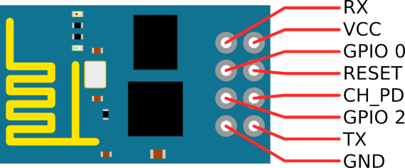
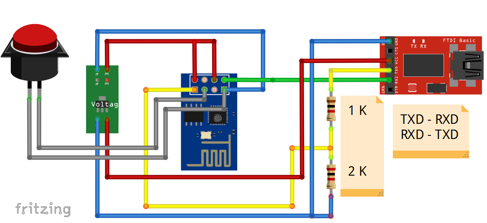

# Скетч для ESP8266 ESP-01
## Распиновка

## Схема подключения

Делитель из резисторов 1К и 2К необязателен

Скорость порта - 115200

## Описание работы

Скетч позволяет удалённо управлять реле, подключенным к ESP на ножку GPIO-2
Для включение верхнего уровня перейти в браузере на <ip_esp>/gpio/1

Выключение <ip_esp>/gpio/0

## Зависимости

Для прошивки скетча в ESP установить платы отсюда: http://arduino.esp8266.com/stable/package_esp8266com_index.json
